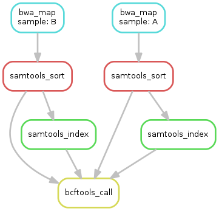

class: top

## 2026 Bioinformatics Colloquium

<br/>
Kevin Counts<br/>
Health Informatics Institute<br/>
University of South Florida<br/>
<https://www.hii.usf.edu/>

---

## Overview

### Snakemake

Tool to create reproducible and scalable data analyses.

### Apptainer

Tool to build and execute containerized applications.


---


<br/><br/>

- Tool to create reproducible and scalable data analyses.

- Operates on workflows described via human readable, Python-based language.

- Runs in local, HPC, or cloud environments with little or no modification to the workflow definition.

---

## Snakemake Overview

<br/><br/>

- Snakemake reads a `Snakefile`.

- A `Snakefile` defines a set of rules.

- Rules have `inputs`, `outputs`, and `actions`.

- Snakemake  works out the correct order of rules to reach a given `target`, then runs them.

---

## Snakemake Rules

Snakemake runs rules necessary to satisfy a "target" rule.

```python
# target rule (first rule by default)
rule all:
    input: "out/filter/abc-123.txt"

# rule "select" output satisfies rule "filter" input
rule select:
    input: "data/abc-123.csv"
    output: "out/select/abc-123.txt"
    shell: "cut -f1,2 {input} > {output}"

# rule "filter" output satisfies rule "all" input
rule filter:
    input: "out/select/abc-123.txt"
    output: "out/filter/abc-123.txt"
    shell: "grep interesting {input} > {output}"
```

---

## Snakemake DAG

<br/><br/>

DAG == Directed Acyclic Graph



---

## Snakemake Job execution

<br/><br/>
A job is executed if:
- output file is target and does not exist
- output file is needed by another executed job and does not exist
- input file is newer than output file
- input file will be updated by other job


---

## Snakemake Wildcards

<br/><br/>

```python
rule all:
    input:
        "out/filter/abc-123.txt",
        "out/filter/def-456.txt",
        "out/filter/xyz-789.txt",

rule select:
    input: "data/{sample}.csv"
    output: "out/select/{sample}.txt"
    shell: "cut -f1,2 {input} > {output}"

rule filter:
    input: "out/select/{sample}.txt"
    output: "out/filter/{sample}.txt"
    shell: "grep interesting {input} > {output}"
```

---

## Snakemake Command line interface

<br/><br/>

```bash
snakemake

snakemake Snakefile

snakemake --dry-run Snakefile

snakemake --profile=stampede Snakefile

snakemake --snakefile=snakefiles/main.smk
```

---

## Snakemake Installation

<br/><br/>

- Suggest "miniforge" to install to `${HOME}/opt/snake/<version>` (e.g. `9.16.3`):
  - `snakemake`
  - `snakemake-executor-plugin-slurm`

- Sample installation script:
  - <https://github.com/countdigi/2603-bio-colloq/bin/install-snakemake>

```bash
# add to $HOME/.bashrc

export PATH=${HOME}/opt/snake/9.16.3/envs/main/bin:${PATH}
```

---

## Demo

Demo

---


<br/><br/>
- Apptainer is a container platform.
- Builds/runs light-weight virtual-machine images.
- Similar to Docker but more popular in HPC environments.
- Original project named "Singularity".
- Original developed at Lawrence Berkeley National Laboratory.

---

## Apptainer Container Image

<br/><br/>

- Container image is stored in a `.sif` file.
- sif stands for “Singularity Image File”
- Instructions for building the `.sif` provided by the `.def` definition file
- `.sif` file is compression of all files in the stand-alone operating system (container).

---

## Apptainer Definition File

<br/><br/>

```bash
$ cat spec/debian.def

Bootstrap: docker
From: debian:13.3

%post
  apt-get update
  apt-get -y upgrade
  apt-get -y install \
    build-essential \
    ca-certificates \
    curl

  apt-get clean
  /bin/rm -rf \
    /var/cache/apt/archives \
    /var/lib/apt/lists/*
```

<br/>

```bash
$ apptainer build img/debian-13.sif spec/debian.def
                      #-- container #-- definition
```

---

## Apptainer Definition File

<br/><br/>

```bash
$ cat spec/debian.def

Bootstrap: localimage
From: img/debian-13.sif

%arguments
  version=1.23

%post
  curl -sSL https://github.com/.../samtools-{{version}}.tar.bz2 \
  | tar jxf -

  cd samtools-{{version}}
  make -j $(nproc)
  make test
  make install
```

---

## Apptainer Execution

<br/><br/>

```bash
apptainer run img/samtools.sif samtools args...
```

<br/>

- `$HOME` is automatically mounted in container
- one or more `--bind <host_path>:<container_path>` may necessary

<br/>

E.g.:
```bash
apptainer run --bind /stampede01:/stampede01 img/samtools.sif ...
```

---

## Thank You

<br/>
Kevin Counts<br/>
Health Informatics Institute<br/>
University of South Florida<br/>
<https://www.hii.usf.edu/>

Links:
- Examples:
  - <https://github.com/countdigi/2603-bio-colloq/>
- Slides:
  - <https://countdigi.github.io/talks/2603-bio-colloq/>
