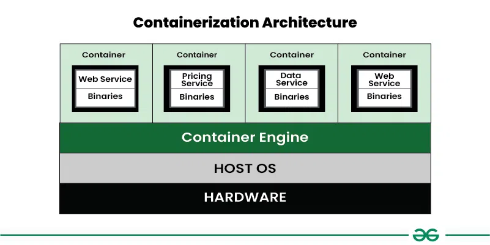
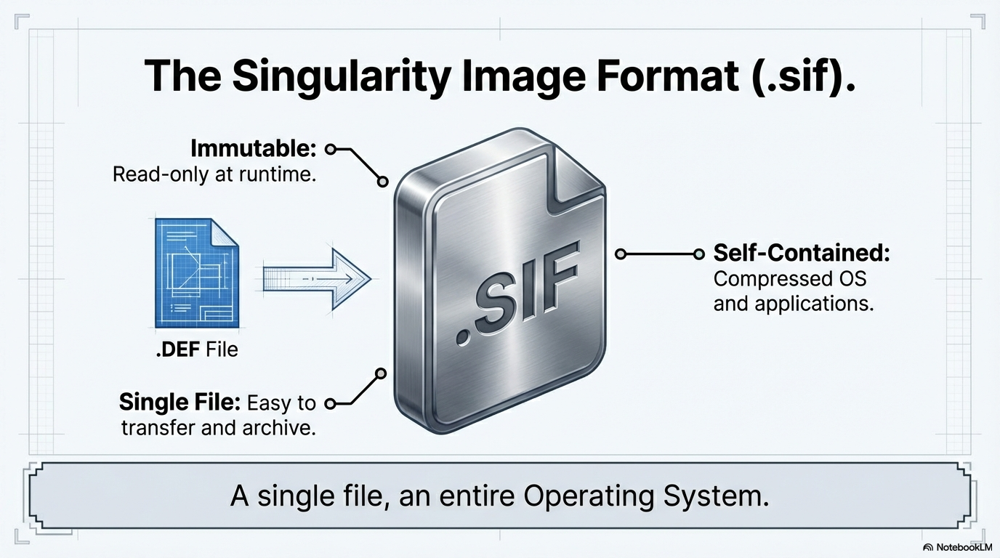
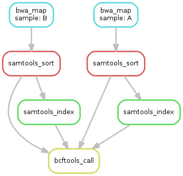

class: top

## 2026 Bioinformatics Colloquium

*An Overview of Application Container and Workflow Tools Used in TEDDY Bioinformatics Analyses.*

<hr/>

Kevin Counts<br/>
Health Informatics Institute<br/>
University of South Florida<br/>

<hr/>

All slides and resources available at:<br/>
<https://github.com/countdigi/2603-bio-colloq>

---

*Application container and workflow tools...*

<hr/>


Build and run **software** containers providing isolated, portable, and reproducible units of execution.


Define computational **workflows** and execute in a portable, scalable, and reproducible manner.

<hr/>

---


Build and run **software** containers providing isolated, portable, and reproducible units of execution.

What is a container?
- Lightweight, portable, self-sufficient unit that bundles application code with all its dependencies
- Share the host machine's operating system kernel but remains isolated
- Runs at native hardware speed - more efficient and less resource-intensive than virtual machines
- Runs consistently across different computing environments
- Avoids "works on my machine" issues

---


Traditional software packaging (pre-2015):
- All packages shared same OS environment with each other<br/>
  (e.g. `/usr/bin/`, `/usr/lib`, `/usr/local/lib`, ...)
- First package built usually successful
- Each subsequent package introduced conflicting dependencies
- There were tricks to isolate using alternate namespacing (`/opt/pkg1`, `/opt/pkg2`) but difficult/awkward to implement.

---


Containers give each package an isolated namespace so it is always the <b/>only application</b>.

<center>

</center>

---


- Apptainer is an open-source container platform developed for scientific computing / HPC environments
- Originally named "Singularity" and developed at Lawrence Berkeley National Laboratory
- Containers stored as a single `SIF` (Singularity Image File) so easy to copy/distribute
- Containers built as "root" but run as a normal user so they do not require special permissions
- Containers are immutable but external filesystems can be mounted for input/output<br/>
- Containers run at **native hardware speed**

---


More about containers:
- Each container has its own isolated filesystem with OS files, libraries, applications, etc.
- Can be based on any flavor/version of Linux (`redhat`, `ubuntu`, `debian`) or can be a blank "scratch" image
- Containers do not have a Linux kernel
- They use a shared kernel running on the host
- Therefore they run at **native hardware speed**
- Linux provides stable ABI (Application Binary Interface) which allows this flexibility and speed
- ABI must be from the same architecture (container built on `x86_64` cannot run on `arm64`)

---




---


Apptainer definition file: `spec/debian.def`:
```bash
Bootstrap: docker
From: debian:13.3

%post
  apt-get update
  apt-get -y upgrade
  apt-get -y install \
    build-essential \
    ca-certificates \
    curl
```
```bash
$ apptainer build img/debian-13.sif spec/debian.def
#                 output_image      input_definition
```

---


Apptainer definition file `spec/samtools.def`:
```bash
Bootstrap: localimage
From: img/debian-13.sif # built in prior example

%arguments
  version=1.22

%post
  curl -sSL https://github.com/samtools-{{version}}.tar.bz2 \
  | tar jxf -

  cd samtools-{{version}}
  make -j $(nproc)
  make test
  make install
```

---


Command to build `spec/samtools.def`:
```bash
$ apptainer build \
  --build-arg version=1.23 \ # {{version}} replaced with '1.23'
  img/samtools-1.23.sif    \ # output_image
  spec/samtools.def          # input_definition
```

---


To execute a container:
```bash
$ apptainer exec img/samtools-1.23.sif samtools --version
#                container_image       software  options...

samtools 1.23
Using htslib 1.23
Copyright (C) 2025 Genome Research Ltd.
... etc.
```

---


Mountpoints
- `$HOME` is automatically mounted in container
- To mount additional paths inside:
  ```bash
  --bind <host_path>:<container_path>
  ```

E.g.:
```bash
$ apptainer exec \
  --bind=/stampede1:/stampede1 \
  --bind=/labdata:/labdata \
   img/samtools-1.23.sif \
   samtools [args...]
```

---


Caveats:
- Since containers are immutable, to add another library to Python, R, etc. you must build a new container
- Difficult to run apptainer inside apptainer (locate both app dependencies in same container)

---


In summary:
- Apptainer builds and run **software** containers providing isolated, portable, and reproducible units of execution.
- *Isolated* - prevents conflicts in application dependencies
- *Portable* - works in multiple environments
- *Reproducible* - behaves the same every time due to its immutability

---


QUESTIONS?

<hr/>

Kevin Counts<br/>
Health Informatics Institute<br/>
University of South Florida<br/>

<hr/>

All slides and resources available at:<br/>
<https://github.com/countdigi/2603-bio-colloq>

---


- Tool to create reproducible and scalable data analyses.

- Operates on workflows described via human readable, Python-based language.

- Runs in local, HPC, or cloud environments with little or no modification to the workflow definition.

---


- Snakemake reads a `Snakefile`.

- A `Snakefile` defines a set of rules.

- Rules have `inputs`, `outputs`, and `actions`.

- Snakemake  works out the correct order of rules to reach a given `target`, then runs them.

---


Snakemake runs rules necessary to satisfy a "target" rule.

```python
# target rule (first rule by default)
rule all:
    input: "out/filter/abc-123.txt"

# rule "select" output satisfies rule "filter" input
rule select:
    input: "data/abc-123.csv"
    output: "out/select/abc-123.txt"
    shell: "cut -f1,2 {input} > {output}"

# rule "filter" output satisfies rule "all" input
rule filter:
    input: "out/select/abc-123.txt"
    output: "out/filter/abc-123.txt"
    shell: "grep interesting {input} > {output}"
```

---


DAG == Directed Acyclic Graph



---


A job is executed if:
- output file is target rule and does not exist<br/>
  (e.g. `rule all:`)
- output file is input of another rule and does not exist
- input file is newer (or updated) compared to output file

---


Wildcards
```python
rule all:
    input:
        "out/filter/abc-123.txt",
        "out/filter/def-456.txt",
        "out/filter/xyz-789.txt",

rule select:
    input: "data/{sample}.csv"
    output: "out/select/{sample}.txt"
    shell: "cut -f1,2 {input} > {output}"

rule filter:
    input: "out/select/{sample}.txt"
    output: "out/filter/{sample}.txt"
    shell: "grep interesting {input} > {output}"
```

---


Command-line interface

```bash
snakemake

snakemake Snakefile

snakemake --dry-run Snakefile

snakemake --profile=stampede Snakefile

snakemake --snakefile=snakefiles/main.smk
```

---


- `bin/install-snakemake` in `2603-bio-colloq` repo
- miniforge to install to: `${HOME}/opt/snake/9.16.3/envs/main/bin`
  - `snakemake`
  - `snakemake-executor-plugin-slurm`
- `export PATH=${HOME}/opt/snake/9.16.3/envs/main/bin:${PATH}`

---


TEDDY GWAS QC Production example:
- <a href="image/gwas-dag.svg">DAG</a>
- <a href="Snakefile.html">Snakefile</a>

---


STAMPEDE head-node: `alpha1.epi.usf.edu`
- `${HOME}` is set to `${HPC_HOME}`
- `${HPC_HOME}` (HPC scratch / Not backed-up)
  - `/stampede1/user/<user>`<br/>
    (e.g. `/stampede1/user/countskm`)
- `${NET_HOME}`
  - `/home/<user>`<br/>
    (e.g.: `/home/countskm`)

---


Stampede: use `--profile=profiles/stampede` from demo directory.

```bash
cat profiles/stampede/config.yaml

executor: slurm
default-resources:
  slurm_account: epi
  slurm_partition: stampede01
  runtime: 4h
  mem: 10G
jobs: 100
max-jobs-per-second: 1
latency-wait: 20
```

---


QUESTIONS?

<hr/>

Kevin Counts<br/>
Health Informatics Institute<br/>
University of South Florida<br/>

<hr/>

All slides and resources available at:<br/>
<https://github.com/countdigi/2603-bio-colloq>
